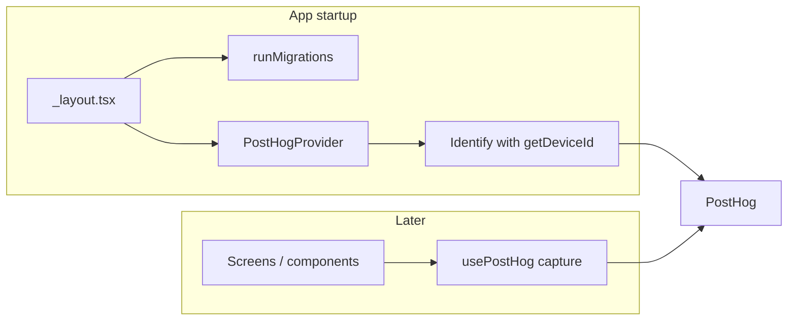

# Add PostHog analytics with user identification

## Current state

- **User identity**: The app already has a stable device/installation ID via [`getDeviceId()`](src/db/device.ts) (Expo `getInstallationIdAsync()` or fallback UUID, stored in AsyncStorage). It is used across DB tables (`study_sessions`, `answer_attempts`, `mock_exams`, `mistakes`). No login/auth — identity is device-based.
- **App bootstrap**: [app/_layout.tsx](app/_layout.tsx) runs `runMigrations()` in a `useEffect`, then hides the splash screen. No `app.config.js` yet; env vars are not used for secrets.

## Architecture



## Implementation steps

### 1. Install dependencies

```bash
npx expo install posthog-react-native expo-file-system expo-device
```

`expo-application` and `expo-localization` are already in [package.json](package.json). PostHog’s React Native SDK uses native modules, so it runs in **development builds** or after prebuild, not in Expo Go.

### 2. Environment variables

- Add **`EXPO_PUBLIC_POSTHOG_KEY`** (Project API Key from PostHog) and **`EXPO_PUBLIC_POSTHOG_HOST`** (e.g. `https://us.i.posthog.com`).
- Introduce **`app.config.js`** (or `app.config.ts`) that reads `process.env.EXPO_PUBLIC_POSTHOG_KEY` and `process.env.EXPO_PUBLIC_POSTHOG_HOST` and exposes them via `extra` (e.g. `extra.posthogKey`, `extra.posthogHost`). Keep using [app.json](app.json) for static config and use `app.config.js` to export a default that merges in `extra` from env. This keeps keys out of version control when using `.env` (add `.env` to `.gitignore` if not already).
- Document in README or a short env example (e.g. `.env.example`) which variables are required.

### 3. Analytics module (optional but recommended)

Create a small wrapper, e.g. **`src/analytics/posthog.ts`** (or `src/lib/analytics.ts`), that:

- Re-exports or wraps PostHog usage so the rest of the app depends on one place.
- Exports an **`identifyUser()`** that:
  - Calls `getDeviceId()` from [src/db/device.ts](src/db/device.ts).
  - Calls `posthog.identify(deviceId)` (and optionally passes traits like `{ anonymous: true }` or `{ source: 'device' }` if you want to segment later).
- Uses the PostHog client from the provider (passed in or via a ref/context). Alternatively, the layout can call `identify` directly after getting the client from the provider; the module then only needs to centralize the logic “get deviceId, then identify” so it can be reused (e.g. after “login” if you add it later).

### 4. Root layout: PostHog provider and identify

In [app/_layout.tsx](app/_layout.tsx):

- Read PostHog config from Constants (e.g. `Constants.expoConfig?.extra?.posthogKey` / `posthogHost`) so it works with `app.config.js` and env.
- Wrap the app with **`PostHogProvider`** from `posthog-react-native`, passing `apiKey` and `options: { host }`. Only render the provider when both key and host are present (graceful no-op when env is missing).
- After the provider is mounted, **identify the user** once: in a child component that has access to `usePostHog()`, run a `useEffect` that calls `getDeviceId()` then `posthog.identify(deviceId)`. That child can be a tiny “PostHogIdentify” component rendered once at the root inside the provider, or the same logic can live in the layout if you obtain the client from a child via a small wrapper. This ties all subsequent events to the same device ID you use in the DB.

Keep the existing `runMigrations()` and splash-screen logic; run PostHog init and identify in parallel or right after so splash screen behavior stays the same.

### 5. Optional: Identify helper and future login

- If you add login later, call `posthog.identify(backendUserId, { email, ... })` when the user logs in (and optionally alias the previous device ID so history merges). For now, identifying with `getDeviceId()` is enough and matches your current “user = device” model.
- Use **`identifyUser()`** (or the same pattern) anywhere you need to ensure the user is identified (e.g. after onboarding or app open); once called at startup, further calls with the same ID are idempotent.

### 6. Usage in the app

- In any screen or component, use **`usePostHog()`** and call **`posthog.capture('event_name', { ... })`** for key actions (e.g. screen views, study session started, mock exam completed). No code changes required for identification beyond the single startup identify.

## Files to add or touch

| Action | File |

|--------|------|

| Add | `app.config.js` (or `app.config.ts`) – read env, expose PostHog key/host in `extra` |

| Add | `src/analytics/posthog.ts` (or `src/lib/analytics.ts`) – `identifyUser(posthog)` using `getDeviceId()` |

| Edit | [app/_layout.tsx](app/_layout.tsx) – PostHogProvider, config from Constants, mount identify logic (e.g. small inner component with usePostHog + useEffect) |

| Optional | `.env.example` – list `EXPO_PUBLIC_POSTHOG_KEY`, `EXPO_PUBLIC_POSTHOG_HOST` |

| Optional | README – one line on required env vars for PostHog |

## Summary

- Reuse **`getDeviceId()`** as the PostHog distinct ID so analytics and DB are aligned.
- Init PostHog at startup via **PostHogProvider** and env-based config; identify once with **`posthog.identify(await getDeviceId())`** so all events are tied to that user.
- No Apple account or backend required; works with your current device-only identity.