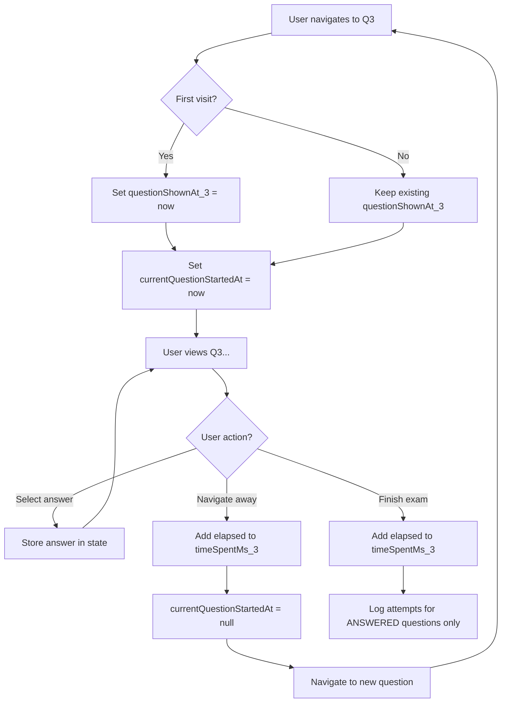

# Mock Exam Time Tracking Improvement

## Problem

Current mock exam behavior has issues:

1. **Multiple redundant attempts logged** per question (on answer selection, on answer change, and on exam finish)
2. **`responseTimeMs` only captures first-view-to-answer time**, not total time spent including navigation
3. User can visit Q3, think, go to Q5, come back to Q3 - but only first viewing time is tracked

## Solution

Track **accumulated viewing time** for each question and log **one attempt per question at exam finish only**.

### Timing Semantics by Mode

| Field | Study/Mistakes Mode | Mock Mode (NEW) |

|-------|---------------------|-----------------|

| `questionShownAt` | When question appeared | First time question was shown |

| `answerSubmittedAt` | When answer tapped | Exam finish time |

| `responseTimeMs` | Time to answer | **Total accumulated viewing time** |

No schema changes required - just different semantics for mock mode.

## Implementation

### New State in [app/mock.tsx](app/mock.tsx)

```typescript
// Existing
const [questionShownAt, setQuestionShownAt] = useState({});  // First shown time per question

// NEW - for accumulated time tracking
const [timeSpentMs, setTimeSpentMs] = useState({});          // Accumulated ms per question
const currentQuestionStartedAtRef = useRef<Date | null>(null);  // When current question view started
```

### Time Accumulation Logic



### Key Changes to [app/mock.tsx](app/mock.tsx)

1. **Remove immediate logging in `handleAnswer`** (lines 187-222)

   - Only update `answers` state, don't call `AttemptsDB.logAnswerAttempt`

2. **Add time accumulation to `handleQuestionNavigation`** (lines 265-289)

   - Before changing question: add elapsed time to `timeSpentMs[currentQuestion]`
   - After setting new question: set `currentQuestionStartedAtRef.current = new Date()`

3. **Modify `handleFinish`** (lines 90-169)

   - First: accumulate remaining time for current question
   - Then: iterate through **ANSWERED questions only** (entries in `answers` state)
   - Log ONE attempt per answered question with:
     - `questionShownAt`: from `questionShownAt` state (first view)
     - `answerSubmittedAt`: exam finish time
     - `responseTimeMs`: from `timeSpentMs` state (total accumulated)
     - `selectedAnswerIndex`: from `answers` state
   - Skip unseen/unanswered questions entirely (no logging)

4. **Handle exam exit scenarios**

### Scenario A: User finishes exam manually (Finish button)

- Accumulate remaining time for current question
- Log attempts **ONLY for questions that have an answer** in `answers` state
- Do NOT log unseen or skipped questions (no schema change needed)

### Scenario B: User leaves exam early (navigates back to main screen)

- Detect navigation away via `useFocusEffect` cleanup or back button handler
- Accumulate remaining time for current question
- Log attempts for all **ANSWERED questions only** (same as finish)
- Mark mock_exam as incomplete (leave `completedAt = null`)

### Scenario C: Timer runs out

- Same as Scenario A (already handled by existing `handleFinish` call)

### Implementation for early exit

Add cleanup handler using `useFocusEffect`:

```typescript
// Helper function to save answered attempts
const saveAnsweredAttempts = async () => {
  if (!mockExamId || !test) return;
  
  // Accumulate current question time
  const finalTimeSpent = { ...timeSpentMs };
  if (currentQuestionStartedAtRef.current) {
    const elapsed = Date.now() - currentQuestionStartedAtRef.current.getTime();
    const qNoStr = String(currentQuestion);
    finalTimeSpent[qNoStr] = (finalTimeSpent[qNoStr] || 0) + elapsed;
  }
  
  const finishTime = new Date();
  
  // Log only ANSWERED questions
  for (const [qNoStr, answerIndex] of Object.entries(answers)) {
    const shownAt = questionShownAt[qNoStr] || examStartedAt;
    const totalTimeMs = finalTimeSpent[qNoStr] || 0;
    
    await AttemptsDB.logAnswerAttempt({
      // ... attempt data with totalTimeMs as responseTimeMs
    });
  }
};

useFocusEffect(
  useCallback(() => {
    return () => {
      // User leaving screen - save any answered questions
      if (mockExamId && !isFinished) {
        saveAnsweredAttempts();
      }
    };
  }, [mockExamId, isFinished, answers, timeSpentMs, questionShownAt])
);
```

## Implementation Details

### Files Modified

1. **[app/mock.tsx](app/mock.tsx)**

   - Added `timeSpentMs` state and `currentQuestionStartedAtRef`
   - Updated `handleQuestionNavigation` to accumulate time before navigation
   - Removed immediate logging from `handleAnswer` (now only updates state)
   - Refactored `handleFinish` to use `saveAnsweredAttempts` helper
   - Added `useFocusEffect` cleanup for early exit handling
   - Added `saveAnsweredAttempts` helper function that accepts accumulated time

2. **[src/db/queries/attempts.ts](src/db/queries/attempts.ts)**

   - Added optional `responseTimeMs` parameter to `AnswerAttemptData` interface
   - Updated `logAnswerAttempt` to use provided `responseTimeMs` if available, otherwise calculate from timestamps
   - Maintains backward compatibility with study/mistakes modes

### Key Implementation Notes

- **Time accumulation**: Happens in `handleQuestionNavigation` before changing questions
- **Helper function**: `saveAnsweredAttempts` accepts `finalTimeSpent` object to avoid duplication
- **Early exit**: `useFocusEffect` cleanup accumulates current question time before calling `saveAnsweredAttempts`
- **State reset**: Both `timeSpentMs` and `currentQuestionStartedAtRef` are reset in `startNewTest`
- **Initial tracking**: First question's view time starts when exam begins (`examStartedAt`)

### Behavior Verification

- ✅ No redundant logging - each question logged exactly once at finish/exit
- ✅ Total time tracked - includes all navigation back and forth
- ✅ Early exit handled - answered questions logged when navigating away
- ✅ Study mode unaffected - continues immediate logging with calculated response time
- ✅ Only answered questions logged - skipped questions not logged

## Study/Mistakes Mode - No Changes

Study mode already works correctly:

- `questionShownAtRef.current = new Date()` on question load
- Immediate logging when answer is tapped
- No answer changing allowed
- Single attempt per question guaranteed
- `responseTimeMs` calculated from `answerSubmittedAt - questionShownAt` (automatic)