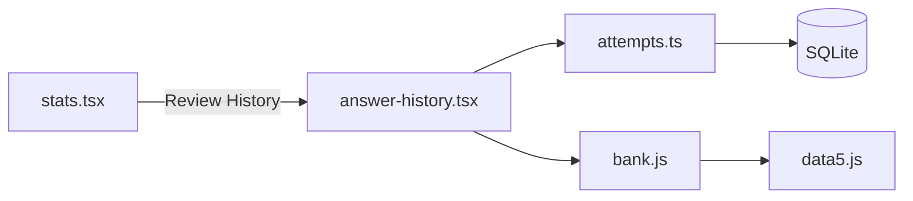

# Review Past Answers Feature

## Overview

Add a new screen to review all past answer attempts, showing the full question context, your selected answer vs. the correct one, timing data, and metadata. Accessible via a button on the Statistics screen.

## Architecture



## Implementation

### 1. Add Database Query

Add a new function in [`src/db/queries/attempts.ts`](src/db/queries/attempts.ts) to fetch paginated answer attempts:

```typescript
export async function getAnswerHistory(
  lang: number,
  limit: number = 50,
  offset: number = 0
) {
  return db.select()
    .from(answerAttempts)
    .where(eq(answerAttempts.lang, lang))
    .orderBy(desc(answerAttempts.createdAt))
    .limit(limit)
    .offset(offset);
}
```

### 2. Create Answer History Screen

Create new screen [`app/answer-history.tsx`](app/answer-history.tsx) with:

- Header with title and back navigation
- FlatList for efficient scrolling of potentially many items
- Each item shows:
  - Question image (if exists) using `AspectImage`
  - Question text
  - All 3 answer options with visual indicators:
    - Green highlight for correct answer
    - Red highlight for wrong selection (if incorrect)
  - Metadata row: mode badge, category, response time, date
- Pull-to-refresh support
- Empty state when no history

### 3. Add Navigation from Statistics

Update [`app/stats.tsx`](app/stats.tsx) to add a "Review History" button/card that navigates to the new screen using Expo Router.

### 4. Add Translations

Add new translation keys in [`src/i18n/strings.js`](src/i18n/strings.js):

- `stats.reviewHistory` - button label
- `history.title` - screen title  
- `history.empty` - empty state message
- `history.responseTime` - response time label
- `history.questionShownAt` - when question was shown
- `history.answeredAt` - when answer was submitted

## Key Files

- [`src/db/queries/attempts.ts`](src/db/queries/attempts.ts) - Add `getAnswerHistory()` query
- [`app/answer-history.tsx`](app/answer-history.tsx) - New screen (create)
- [`app/stats.tsx`](app/stats.tsx) - Add navigation button
- [`src/i18n/strings.js`](src/i18n/strings.js) - Add translations
- [`src/lib/bank.js`](src/lib/bank.js) - Use existing `findQuestionById()` to fetch question details

## UI Design

Each history item will be a Card showing:

- Top: Question image (optional) + question text
- Middle: 3 answer buttons (non-interactive, just display) with correct/selected highlighting
- Bottom metadata section with timing details:
  - **Response time**: How long you took to answer (e.g., "2.3s")
  - **Question shown at**: Timestamp when question appeared
  - **Answer submitted at**: Timestamp when you answered
  - **Date**: Full date/time of the attempt
  - Mode badge (study/mock/mistakes)
  - Category

The timing section will use a collapsible or compact format to avoid clutter while making all data accessible.