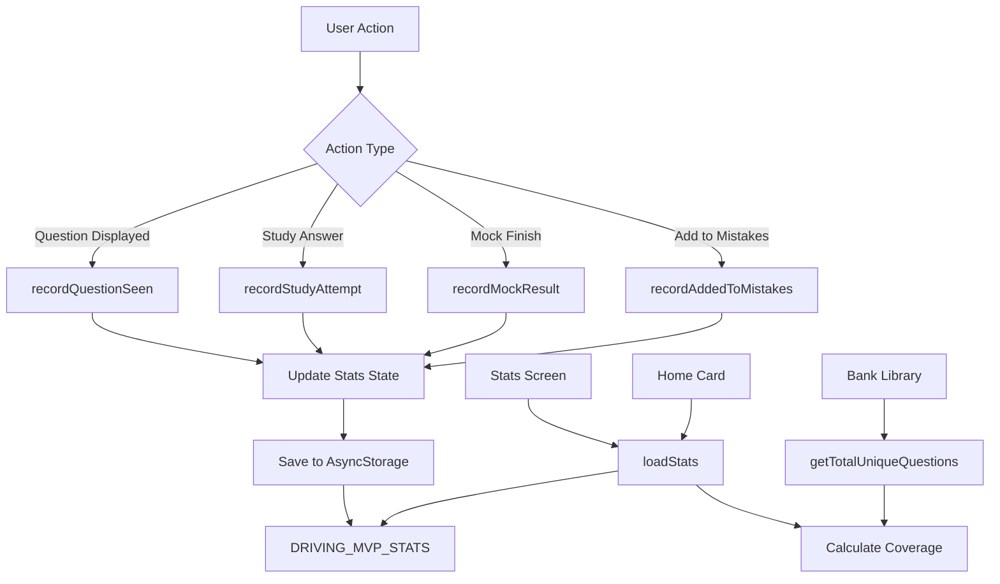

# Statistics Feature Implementation Plan

## Overview

This plan implements a comprehensive statistics tracking system that makes the app feel like a "serious exam prep product" by tracking study performance, mock exam results, and engagement metrics. All data is stored locally using AsyncStorage, separate from the existing progress tracking.

## Architecture

### Data Flow



### Key Components

1. **Stats Library** (`src/lib/stats.js`): Core tracking functions and storage management
2. **Stats Screen** (`app/stats.tsx`): New screen displaying all statistics
3. **Updated Home Screen** (`app/home.tsx`): Card showing progress preview
4. **Integration Points**: Study, Mistakes, and Mock screens call tracking functions

## Implementation Details

### 1. Stats Library (`src/lib/stats.js`)

**Storage Key**: `DRIVING_MVP_STATS`

**Core Functions**:

- `loadStats()`: Load stats from AsyncStorage, return default structure if missing
- `saveStats(stats)`: Persist stats to AsyncStorage
- `getStatsForLang(lang)`: Get stats for specific language, initialize if needed
- `recordStudyAttempt({ lang, category, isCorrect })`: Track study answer
- `recordQuestionSeen({ lang, qid })`: Track when a question is displayed (seen at least once)
- `recordMockResult({ lang, testId, score, maxScore, minToPass, passed, durationSec, wrongCount })`: Track mock exam completion
- `recordAddedToMistakes({ lang, historyId, count })`: Update mock history when wrong answers added
- `updateStreak({ lang, isMockPass })`: Update engagement streak

**Helper Functions**:

- `todayKey()`: Return current date as `yyyyMMdd` string
- `yesterdayKey()`: Return yesterday's date as `yyyyMMdd` string
- `pruneDaily(stats, keepDays=14)`: Remove daily entries older than keepDays
- `capHistory(history, max=50)`: Limit history array to max entries
- `calculateAccuracy(attempts, correct)`: Calculate percentage, return "—" if attempts=0
- `getLast7Days()`: Return array of date keys for last 7 days
- `getTotalUniqueQuestions(lang)`: Get total count of unique questions in bank (uses `buildQuestionIndex`)
- `calculateCoverage(lang, questionsSeen)`: Calculate coverage percentage (questionsSeen.length / totalUniqueQuestions)

**Data Structure**:

```javascript
{
  statsByLang: {
    "1": {
      study: {
        attempts: 0,
        correct: 0,
        wrong: 0,
        daily: {},
        byCategory: {}
      },
      mock: {
        examsTaken: 0,
        examsPassed: 0,
        bestScore: 0,
        lastScore: 0,
        history: []
      },
      engagement: {
        currentStreak: 0,
        lastStudyDate: null,
        lastOpenedDate: null
      },
      coverage: {
        questionsSeen: []  // Array of question IDs (qid strings) seen at least once
      }
    }
    // ... languages 2, 3
  }
}
```

**Key Implementation Notes**:

- Track only first answer submission per question view (use a flag in screen components)
- Streak increments when `lastStudyDate` is yesterday, resets to 1 if gap exists
- Daily tracking uses `yyyyMMdd` format for easy date math
- Mock testId format: `"L{lang}-T{testIndex}"` (requires modifying `getRandomTest` to return index)

### 2. Bank Library Enhancement (`src/lib/bank.js`)

**New Functions**:

- `getRandomTestWithIndex(lang)`: Returns `{ test, testIndex }` instead of just test
  - This allows tracking which test was used for mock exams
  - Update `getRandomTest` to use this internally for backward compatibility
- `getTotalUniqueQuestions(lang)`: Returns total count of unique questions in the bank
  - Uses `buildQuestionIndex(lang)` and returns `Object.keys(index).length`
  - Cached per language to avoid rebuilding index unnecessarily

**Alternative Approach** (if modifying bank.js is undesirable):

- Track testIndex separately in MockScreen state when test is selected
- Store testIndex alongside test object

### 3. Study Screen Integration (`app/study.tsx`)

**Changes**:

- Add `hasRecordedAnswer` ref to track if current question's answer was already recorded
- In `handleAnswer`, check `hasRecordedAnswer` before calling `recordStudyAttempt`
- Reset `hasRecordedAnswer` when loading new question
- Get selected category from state (already available)
- Call `recordStudyAttempt({ lang, category: selectedCategory, isCorrect })`
- Call `updateStreak({ lang, isMockPass: false })` on first answer of day

**Tracking Logic**:

```javascript
const hasRecordedAnswer = useRef(false);
const hasRecordedSeen = useRef(false);

const loadNewQuestion = (currentLang, category = selectedCategory) => {
  // ... existing question loading logic ...
  
  // Track question as seen when it loads
  if (q && !hasRecordedSeen.current) {
    recordQuestionSeen({ lang: currentLang, qid: q.qid });
    hasRecordedSeen.current = true;
  }
  
  // Reset flags for new question
  hasRecordedAnswer.current = false;
  hasRecordedSeen.current = false;
  
  setQuestion(q);
  // ... rest of logic ...
};

const handleAnswer = async (answerIndex) => {
  if (isAnswered || !question || hasRecordedAnswer.current) return;
  
  // ... existing answer logic ...
  
  // Record stats (only once per question)
  if (!hasRecordedAnswer.current) {
    await recordStudyAttempt({
      lang,
      category: selectedCategory === 'all' ? null : selectedCategory,
      isCorrect: correct
    });
    await updateStreak({ lang, isMockPass: false });
    hasRecordedAnswer.current = true;
  }
};
```

### 4. Mistakes Screen Integration (`app/mistakes.tsx`)

**Changes**:

- Same pattern as Study screen: add `hasRecordedAnswer` and `hasRecordedSeen` refs
- Track question as seen in `loadQuestion` function when question loads
- Track answers identically to Study screen
- Get category from state (already available)

### 5. Mock Screen Integration (`app/mock.tsx`)

**Changes**:

- Track `testIndex` when test is selected (modify `startNewTest` to use `getRandomTestWithIndex`)
- Store `testIndex` in state
- Track questions as seen when mock exam starts - iterate through all questions in test and call `recordQuestionSeen` for each
- In `handleFinish`:
  - Calculate `testId = "L{lang}-T{testIndex}"`
  - Count wrong answers for `wrongCount`
  - Calculate `durationSec` from timer if available
  - Call `recordMockResult({ lang, testId, score, maxScore, minToPass, passed, durationSec, wrongCount })`
  - If passed, call `updateStreak({ lang, isMockPass: true })`
- In `handleAddWrongToMistakes`:
  - Get most recent history entry ID
  - Count how many wrong answers were added
  - Call `recordAddedToMistakes({ lang, historyId, count })`

**Test ID Tracking**:

```javascript
const [testIndex, setTestIndex] = useState(null);

const startNewTest = async (currentLang) => {
  const { test, testIndex: idx } = getRandomTestWithIndex(currentLang);
  setTest(test);
  setTestIndex(idx);
  
  // Track all questions in mock exam as seen
  if (test && test.otazky) {
    for (let qNo = 1; qNo <= test.pocet; qNo++) {
      const qNoStr = String(qNo);
      const questionData = test.otazky[qNoStr];
      if (questionData && questionData[0] && questionData[0].id) {
        await recordQuestionSeen({ lang: currentLang, qid: String(questionData[0].id) });
      }
    }
  }
  
  // ... rest of logic ...
};

const handleFinish = async () => {
  // ... calculate score ...
  const testId = `L${lang}-T${testIndex}`;
  const wrongCount = Object.values(results).filter(r => !r).length;
  
  await recordMockResult({
    lang,
    testId,
    score: totalScore,
    maxScore: totalMax,
    minToPass: test.minbody,
    passed: totalScore >= test.minbody,
    durationSec: timeRemaining > 0 ? test.cas - timeRemaining : undefined,
    wrongCount
  });
  
  if (totalScore >= test.minbody) {
    await updateStreak({ lang, isMockPass: true });
  }
};
```

### 6. Home Screen Update (`app/home.tsx`)

**Changes**:

- Replace "MISTAKE COUNT" card with "YOUR PROGRESS" card
- Load stats on focus
- Display:
  - Mistakes remaining (from progress)
  - Accuracy (7d): Calculate from stats `study.daily` last 7 days
  - Streak: From `engagement.currentStreak`
- Make card pressable → navigate to `/stats`
- Show "—" for accuracy if no data

**Card Structure**:

```tsx
<Pressable onPress={() => router.push('/stats')}>
  <Card>
    <UIText variant="caption">YOUR PROGRESS</UIText>
    <View>
      <UIText>Mistakes left: {mistakeCount}</UIText>
      <UIText>Accuracy (7d): {recentAccuracy}%</UIText>
      <UIText>Streak: {streak} days</UIText>
    </View>
  </Card>
</Pressable>
```

### 7. Statistics Screen (`app/stats.tsx`)

**New File**: Create comprehensive stats display screen

**Sections**:

1. **Overview Card**:

   - Mistakes remaining
   - Study attempts (lifetime)
   - Accuracy (lifetime)
   - Accuracy (last 7 days)
   - Question coverage: "X / Y questions seen (Z%)"
     - X = questionsSeen.length
     - Y = totalUniqueQuestions (from bank)
     - Z = coverage percentage

2. **Last 7 Days Card**:

   - List each day (today → 6 days ago)
   - Show attempts and accuracy per day
   - Empty state if no data

3. **Mock Exams Card**:

   - Exams taken
   - Pass rate
   - Best score
   - Last score
   - Optional: Show last 5 history items inline

4. **Consistency Card**:

   - Current streak
   - Last study date (formatted: "Today", "Yesterday", or date)

5. **Debug Section** (optional):

   - Reset statistics button (dev only)

**Implementation**:

- Use `useFocusEffect` to reload stats when screen gains focus
- Calculate all derived metrics (accuracy, pass rate, etc.)
- Format dates appropriately
- Handle empty states gracefully
- Use existing UI components (Card, UIText, Button, etc.)

### 8. Navigation Update (`app/_layout.tsx`)

**Changes**:

- Add `stats` screen to Stack configuration

### 9. Translation Strings (`src/i18n/strings.js`)

**New Keys**:

- `stats.title`: "Statistics" / "Štatistiky" / "Statisztikák"
- `stats.yourProgress`: "Your Progress" / "Váš pokrok" / "Az Ön előrehaladása"
- `stats.mistakesRemaining`: "Mistakes remaining" / "Zostávajúce chyby" / "Hátralévő hibák"
- `stats.studyAttempts`: "Study attempts" / "Pokusy o štúdium" / "Tanulási kísérletek"
- `stats.accuracyLifetime`: "Accuracy (lifetime)" / "Presnosť (celkovo)" / "Pontosság (összesen)"
- `stats.accuracy7d`: "Accuracy (last 7 days)" / "Presnosť (posledných 7 dní)" / "Pontosság (utolsó 7 nap)"
- `stats.last7Days`: "Last 7 days" / "Posledných 7 dní" / "Utolsó 7 nap"
- `stats.mockExams`: "Mock Exams" / "Skúšobné testy" / "Próba vizsgák"
- `stats.examsTaken`: "Exams taken" / "Uskutočnené testy" / "Elvégzett vizsgák"
- `stats.passRate`: "Pass rate" / "Úspešnosť" / "Sikeres arány"
- `stats.bestScore`: "Best score" / "Najlepšie skóre" / "Legjobb pontszám"
- `stats.lastScore`: "Last score" / "Posledné skóre" / "Utolsó pontszám"
- `stats.consistency`: "Consistency" / "Konzistencia" / "Konzisztencia"
- `stats.currentStreak`: "Current streak" / "Aktuálny pás" / "Jelenlegi sorozat"
- `stats.lastStudy`: "Last study" / "Posledné štúdium" / "Utolsó tanulás"
- `stats.today`: "Today" / "Dnes" / "Ma"
- `stats.yesterday`: "Yesterday" / "Včera" / "Tegnap"
- `stats.noData`: "Start studying to see your progress here." / "Začnite študovať, aby ste tu videli svoj pokrok." / "Kezdjen el tanulni, hogy itt lássa az előrehaladását."
- `stats.noExams`: "Take a mock exam to track your results." / "Urobte skúšobný test na sledovanie výsledkov." / "Végezzen próba vizsgát az eredmények követéséhez."
- `stats.questionCoverage`: "Question coverage" / "Pokrytie otázok" / "Kérdések lefedettsége"
- `stats.questionsSeen`: "Questions seen" / "Videné otázky" / "Látott kérdések"
- `stats.ofTotal`: "of {total}" / "z {total}" / "{total}-ból"

## Edge Cases & Considerations

1. **First Answer Tracking**: Use refs to ensure only first submission is counted
2. **Question Seen Tracking**: Track when question is displayed (not just answered) - use refs to avoid duplicate tracking per question view
3. **Coverage Calculation**: Use `buildQuestionIndex` to get total unique questions - this is cached per language
4. **Date Handling**: Use `yyyyMMdd` format for consistent date math
5. **Missing Data**: Show "—" for accuracy when attempts = 0
6. **Language Switching**: Stats are per-language, automatically handled by structure
7. **Reset Progress**: Does NOT reset stats (separate storage key)
8. **Test ID Stability**: Test index approach is stable as long as test array order doesn't change
9. **History Capping**: Limit mock history to 50 entries to prevent storage bloat
10. **Daily Pruning**: Keep last 14 days of daily stats, prune older entries
11. **Questions Seen Storage**: Store as array of qid strings - use Set-like logic to avoid duplicates when adding

## Testing Considerations

- Test streak calculation (yesterday, today, gap)
- Test accuracy calculations (0 attempts, partial data)
- Test mock exam tracking (pass/fail, history)
- Test category tracking (null vs category name)
- Test language switching (separate stats per language)
- Test question coverage tracking (seen vs total)
- Test question seen deduplication (same question shown multiple times)
- Test empty states in stats screen
- Test date formatting (today, yesterday, older dates)

## File Changes Summary

**New Files**:

- `src/lib/stats.js` - Stats tracking library
- `app/stats.tsx` - Statistics screen

**Modified Files**:

- `src/lib/bank.js` - Add `getRandomTestWithIndex` and `getTotalUniqueQuestions` functions
- `app/study.tsx` - Add stats tracking calls (answers + question seen)
- `app/mistakes.tsx` - Add stats tracking calls (answers + question seen)
- `app/mock.tsx` - Add mock exam tracking, test index tracking, and question seen tracking
- `app/home.tsx` - Update card to show progress preview, make it navigate to stats
- `app/_layout.tsx` - Add stats screen to navigation
- `src/i18n/strings.js` - Add translation keys for stats screen including coverage metrics

**Storage Keys**:

- New: `DRIVING_MVP_STATS` (separate from `DRIVING_MVP_PROGRESS`)