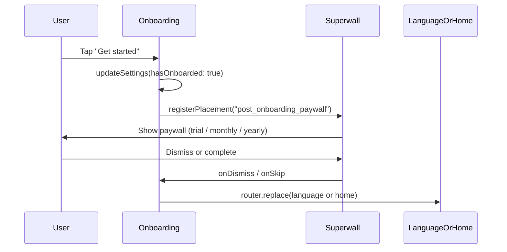

# Superwall React Native integration plan

## Prerequisite: Superwall Docs MCP

The **Superwall Docs MCP** is not currently enabled in this project. Only `cursor-ide-browser` and `cursor-browser-extension` appear under [mcps](mcps/). For implementation, we will use the official Superwall Expo docs ([superwall.com/docs/expo](https://superwall.com/docs/expo)) as the source of truth. If you want in-editor doc lookups, add the Superwall Docs MCP and point it to: [https://superwall.com/docs/sdk/guides/vibe-coding](https://superwall.com/docs/sdk/guides/vibe-coding).

---

## 1. Install the Superwall SDK

- **Package:** Use the **Expo SDK** (`expo-superwall`), not the deprecated `@superwall/react-native-superwall`. Your app is Expo 54; the Expo SDK requires Expo 53+.
- **Command:** `npx expo install expo-superwall`
- **Reference:** [Install the SDK – Expo](https://superwall.com/docs/expo/quickstart/install)

---

## 2. Configure with your API key

- **API key:** `pk_m0UT47lVI0Yc4cPby_ZXi` (use for both iOS and Android unless you have separate keys).
- **Config:**
  - Add the key to [app.config.js](app.config.js) under `extra` (e.g. `superwallApiKey`) so it can be read via `expo-constants`, keeping the key out of source if you use env vars.
  - In [app/_layout.tsx](app/_layout.tsx), wrap the app with `<SuperwallProvider>` from `expo-superwall`, passing `apiKeys={{ ios: key, android: key }}` (same key for both is fine). Place it so it wraps the existing tree (e.g. outside or inside `PostHogProvider`; docs recommend as early as possible).
- **Note:** Superwall does not refetch config on hot reload; restart the app after changing products/paywalls.

---

## 3. Present a paywall after onboarding, before language

**Current flow (from [app/onboarding.tsx](app/onboarding.tsx)):** On “Get started”, `handleFinish` runs → `updateSettings({ hasOnboarded: true })` → then `router.replace(settings.hasChosenLanguage ? '/home' : '/language')`.

**Desired flow:** Onboarding finish → **show paywall** → on dismiss/skip/subscribe → then language (or home if already `hasChosenLanguage`).

**Implementation:**

- In [app/onboarding.tsx](app/onboarding.tsx):
  - Use the `usePlacement` hook from `expo-superwall` with a single placement (e.g. `post_onboarding_paywall`).
  - In `handleFinish`, after `updateSettings({ hasOnboarded: true })` and `getSettings()`:
    - Store the next route in a ref: `nextRoute = settings.hasChosenLanguage ? '/home' : '/language'`.
    - Do **not** call `router.replace` yet.
    - Call `registerPlacement({ placement: 'post_onboarding_paywall' })` (no `feature` callback so the paywall is shown when the campaign triggers).
  - In the same `usePlacement` callbacks:
    - **onDismiss** and **onSkip:** call `router.replace(nextRoute)` so that after the user dismisses, skips, or completes the paywall they go to language or home.
  - Keep the fade-out and analytics in `handleFinish`; only the final navigation is deferred until the placement’s onDismiss/onSkip.

**Dashboard:** In the Superwall dashboard, create a placement with the same identifier (e.g. `post_onboarding_paywall`) and attach a campaign that shows your paywall. The paywall content (including 3-day trial, monthly, yearly) is configured there.

---

## 4. Offer structure: 3-day trial, monthly, yearly

- This is **not** implemented in app code. In the Superwall dashboard:
  - Create products: e.g. a 3-day free trial, a monthly subscription, and a yearly subscription (via App Store / Play Store product IDs).
  - Attach these products to the paywall used for the post-onboarding placement.
  - Design the paywall (trial CTA, monthly/yearly options) in the paywall editor.

The app only triggers the placement; product and copy are dashboard-only.

---

## 5. Deep link handling

- **Purpose (from [Superwall – Handling Deep Links](https://superwall.com/docs/expo/quickstart/in-app-paywall-previews)):** Preview paywalls on device and deep link into campaigns.
- **App-side:**
  - Define a **custom URL scheme** so the app can open via e.g. `yourapp://`. For Expo, set `scheme` in [app.json](app.json) (or in [app.config.js](app.config.js)) so the native project gets the correct URL types (iOS) and intent filters (Android). No extra “handling” code is required for basic preview; the SDK responds when the app is opened from a Superwall link.
  - If you use **Web Checkout** later, you’ll add Universal Links (iOS) per the same doc.
- **Dashboard:** In Superwall Dashboard → Settings → General, set **Apple Custom URL Scheme** (and Android equivalent if shown) to the same scheme (no slashes).

---

## 6. User identification and attributes (your input)

Before implementing, two decisions:

**Identifying the user**

- **Option A – Anonymous:** Use a stable device/user ID (e.g. the same value you use for PostHog in [src/lib/analytics.ts](src/lib/analytics.ts) via `getDeviceId()`) and call Superwall’s `identify()` with it so paywall state is consistent per device.
- **Option B – Logged-in:** If you add auth later, call `identify(userId)` after login and optionally `reset()` on logout.

**Setting user attributes**

- Superwall’s `setUserAttributes` / Expo’s `useUser().update()` are used for targeting and personalization (e.g. “show different paywall for users who chose language X”). Decide which attributes you want (e.g. `language`, `hasOnboarded`, or nothing for now) and we wire them in one place (e.g. after onboarding or in root layout) so they stay in sync.

Once you choose (1) anonymous vs logged-in identification and (2) which attributes to set (if any), we can add the exact `identify()` and `update()` calls in the right screens/layout.

---

## Implementation order and testing

| Step | Action                                                               | How to test                                                                            |
| ---- | -------------------------------------------------------------------- | -------------------------------------------------------------------------------------- |
| 1    | Install `expo-superwall`                                             | Build runs; no import errors.                                                          |
| 2    | Configure API key + `SuperwallProvider` in `_layout.tsx`             | App launches; Superwall dashboard may show a new session.                              |
| 3    | Add placement in onboarding and defer navigation to onDismiss/onSkip | Finish onboarding → paywall appears (if campaign is set) → dismiss → language or home. |
| 4    | Set URL scheme in app config; add scheme in Superwall dashboard      | Scan paywall preview QR from dashboard; app opens to paywall preview.                  |
| 5    | (After your choices) Add `identify()` and optional `update()`        | Verify in dashboard or via behavior (e.g. paywall state per user/device).              |

---

## Summary diagram

No code changes will be made until you confirm this plan and, for step 6, your choices for user identification and attributes.